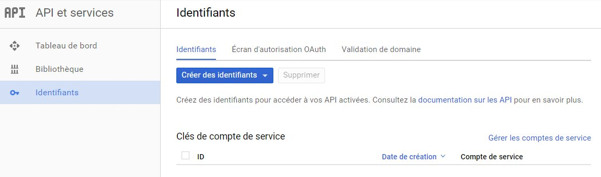
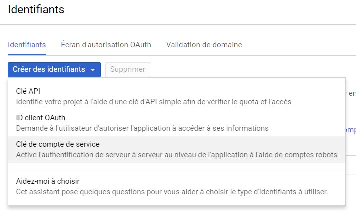
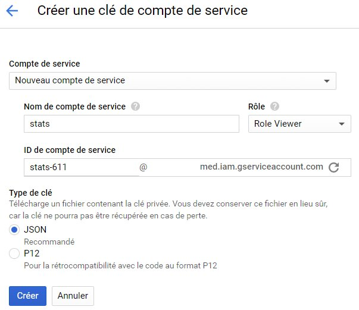
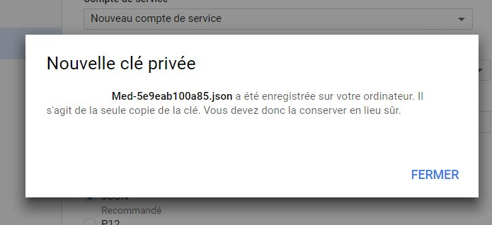
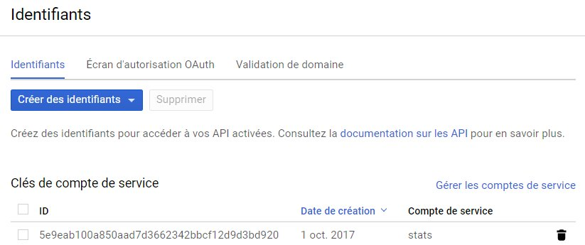
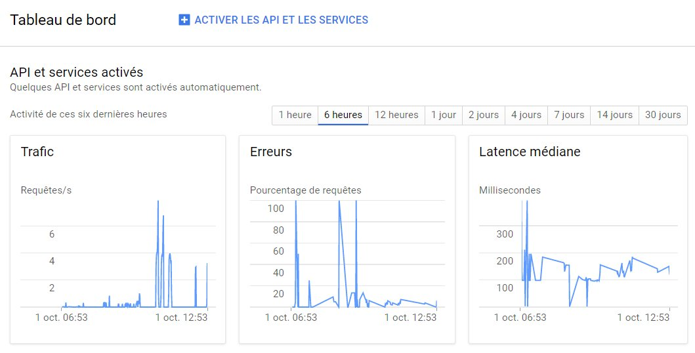
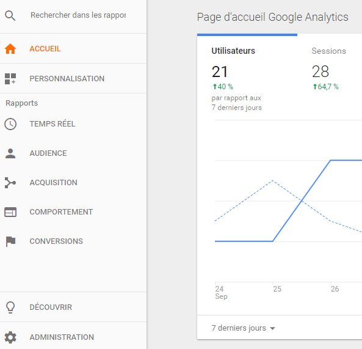
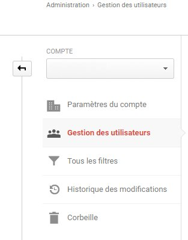
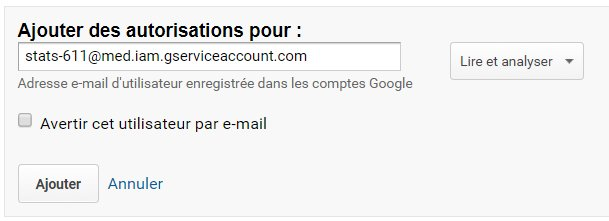

Google Analytics API v4 Symfony bundle
======================================

Ceci est un fork du bundle mediafigaro/google-analytics-symfony en version 1.0. 
La documenttaion du bundle est disponible à l'adresse : https://mediafigaro.github.io

La version présente ajoute les élements suivants :
* Support Symfony 3 + php 7.0 ;
* Ajout du support des dimensions (1 max) ;
* Ajout d'une class pour le chargement des données pour un jour ou sur un intervalle (mode batch) ;
* Enregistremennt des données dans une base de données (ici, mongoDB) 

 
** Cette version s'appuie sur l'API Google et le bundle mediafigaro/google-analytics-api-symfony. **

# Utilisation

Ce bundle a été conçu par la division média du magazine Le Figaro http://media.figaro.fr, 
il permet la récupération des métriques issus de la plateforme Google Analytics. 

Il permet un accès simple à l'API Google Analytics API 4 et aux principaux paramètres GA.

Pour pouvoir l'utiliser, il est nécessire de configurer un projet sur Google Console pour Google Analytics, 
obtenir la clé json, puis configurer ce paquet en définissant son chemin. 

## Google Console pour GA

Google Console pour Google Analytics est disponible à l'adresse :
https://console.developers.google.com/apis/

Une fois connecté, il suffit de cliquer sur ** identifiants ** puis sur le bouton ** créer des identifiants ** :

Il faut choisir un compte de service :

Il faut tout d'abord choisir l'option ** Nouveau compte de service ** et définir le compte. Ici, nous avons
choisi comme nom : ** stats **

Nous avons choisi comme role le profile ** Role viewer ** 

L'Id du compte de service est ajouté automatiquement. Il correspond à l'adresse qu'il faudra utiliser dans Google Analytics.

Il faut enfin choisir une clée au format json. Cette clée sera utilisée pour autoriser le serveur à se connecter 
via l'API à Google Analytics.

 
Le fichier est téléchargée.

Le compte de service est créé.

Une fois cette opération terminée, il faudra ** activer ** le service pour pouvoir l'utiliser depuis GA.

 
## Google Analytics 

L'application GA permet de configurer et suivre les indicateurs d'activité d'un site Internet. 
Elle est disponible à l'adresse : https://analytics.google.com/analytics/web/

Pour que l'accès déclaré dans Google Console fonctionne, il est obligatoire d'autoriser 
l'accès avec l'adresse du compte de service. Pour cela, il suffit de cliquer sur le bouton ** Administration **

et sur ** Gestion des utilisateurs ** pour ajouter une nouvelle autorisation.

Dans la zone ** Ajouter des autorisations pour ** ajoutez l'adresse créée dans Google Console :
stats-611@med.iam.gserviceaccount.com (ie. dans notre exemple).

Pour vérifier si l'accès est correct, l'URL suivante permettra de tester le profil (ex id: 111111111):

http://symfony.dev/app_dev.php/analytics-api/111111111 

# installation

Il est possible d'installer le bundle depuis composer ou en clonnant le projet. 

    composer require lhadjadj/google-analytics-api-symfony

    
Puis il faut ajouter la réference du bundle dans /app/AppKernel.php :

    $bundles = [
        ...
        new lhadjadj\GoogleAnalyticsApi\GoogleAnalyticsApi(),
    ];

# configuration

    google_analytics_api.google_analytics_json_key

Set the relative path for your json key (set it on your server, better not into your repository) from execution path, ex: /data/analytics/analytics-27cef1a4c0fd.json.

/app/config/parameters.yml

    google_analytics_json_key: "../data/analytics/analytics-27cef1a4c0fd.json"

/app/config/config.yml

    google_analytics_api:
        google_analytics_json_key: "%google_analytics_json_key%"
        
# Google API key

Generate the json file from https://console.developers.google.com/start/api?id=analyticsreporting.googleapis.com&credential=client_key by creating a project, check the documentation : https://developers.google.com/analytics/devguides/reporting/core/v4/quickstart/service-php.

# Google Analytics API v4

List of metrics for report building with search engine : https://developers.google.com/analytics/devguides/reporting/core/dimsmets eg. ga:sessions, ga:visits, ga:bounceRate ...

Objects : https://github.com/google/google-api-php-client-services/tree/master/AnalyticsReporting

(example : ReportData object : https://github.com/google/google-api-php-client-services/blob/master/AnalyticsReporting/ReportData.php)

Samples : https://developers.google.com/analytics/devguides/reporting/core/v4/samples

# debug

Add the debug routes for development purposes :

/app/config/routing_dev.yml

    _google_analytics_api:
        resource: "@GoogleAnalyticsApi/Resources/config/routing_dev.yml"

http://symfony.dev/app_dev.php/analytics-api/000000000 

000000000 = profile id that you can find in the analytics URL, p000000000 :

https://analytics.google.com/analytics/web/?hl=en&pli=1#management/Settings/a222222222w1111111111p000000000/%3Fm.page%3DPropertySettings/

Result of this debug page :

# errors

In that 403 error case, follow the link and authorize the API v4.

    ...
        "message": "Google Analytics Reporting API has not been used in project xxxxxx-xxxxxx-000000 
        before or it is disabled. Enable it by visiting 
        https://console.developers.google.com/apis/api/analyticsreporting.googleapis.com/overview?project=xxxxxx-xxxxxx-000000 
        then retry. If you enabled this API recently, wait a few minutes for the action to propagate 
        to our systems and retry.",
        "domain": "global",
        "reason": "forbidden"
    }
    ],
    "status": "PERMISSION_DENIED"

# example

Call the service :

    $analyticsService = $this->get('google_analytics_api.api');
    $analytics = $analyticsService->getAnalytics();
    
Use the method helpers to get the main metrics within a date range :
    
    $viewId = '000000000'; // set your view id
    
    // get some metrics (last 30 days, date format is yyyy-mm-dd)
    $sessions = $analyticsService->getSessionsDateRange($viewId,'30daysAgo','today');
    $bounceRate = $analyticsService->getBounceRateDateRange($viewId,'30daysAgo','today');
    $avgTimeOnPage = $analyticsService->getAvgTimeOnPageDateRange($viewId,'30daysAgo','today');
    $pageViewsPerSession = $analyticsService->getPageviewsPerSessionDateRange($viewId,'30daysAgo','today');
    $percentNewVisits = $analyticsService->getPercentNewVisitsDateRange($viewId,'30daysAgo','today');
    $pageViews = $analyticsService->getPageViewsDateRange($viewId,'30daysAgo','today');
    $avgPageLoadTime = $analyticsService->getAvgPageLoadTimeDateRange($viewId,'30daysAgo','today');

# contribution

You are welcome to contribute to this small Google Analytics v4 wrapper, to create more helpers or more.

# more tools

Try the Symfony Debug Toolbar Git : https://github.com/kendrick-k/symfony-debug-toolbar-git and the docker Service Oriented Architecture for Symfony : https://github.com/mediafigaro/docker-symfony.

# tutorial

French [tutorial](https://www.supinfo.com/articles/single/2423-symfony-27-integration-google-analytics) by Jérémy PERCHE, SUPINFO student.
